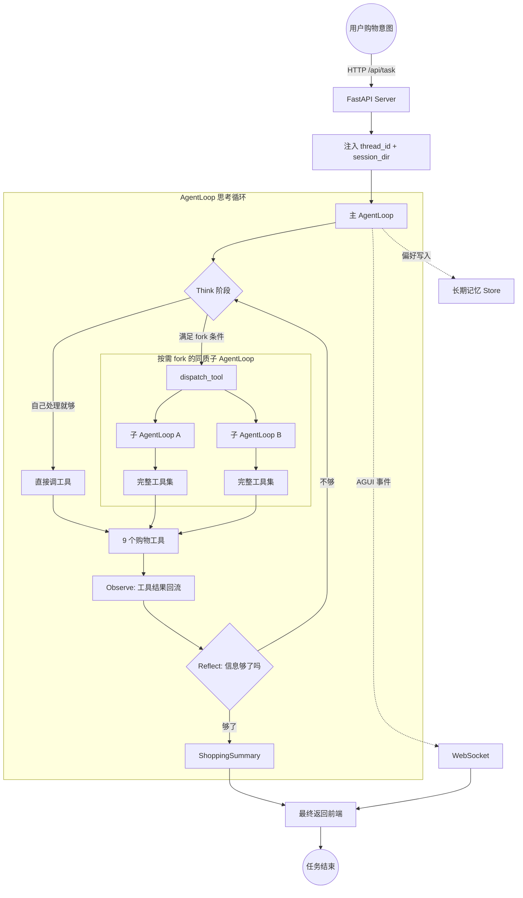

# 09 Globex项目总览与工程初始化

来源：https://alidocs.dingtalk.com/i/nodes/GZLxjv9VGqgwQMXxt6BgjX6x86EDybno

作者：会敲代码的泡

创建时间：06-15 15:08

## AI 概览

Globex 是一个面向跨平台购物场景的对话式 Agent。它不是把用户输入直接丢给搜索接口，而是通过主 AgentLoop 统筹任务，并在需要并行、隔离上下文或深入搜索时 fork 同质子 AgentLoop。系统围绕 9 个购物工具和 5 类基础设施组织，实现需求拆解、跨平台检索、比价、偏好记忆、实时进度反馈和后续评测训练闭环。

## 本章课程目标

- 理解 Globex 要解决的真实问题：跨平台对话式购物 Agent，而不是普通检索框。
- 建立项目整体架构印象：1 个主 AgentLoop、N 个按需 fork 的同质子 AgentLoop、9 个核心工具、5 类基础设施。
- 理解 `thread_id`、`session_dir`、WebSocket 在前后端联动中的位置。
- 看懂项目目录结构，知道后续代码应放在哪一层。

## 1、本章导读

### 1.1 最终要做成什么样

Globex 对外是一个跨境购物助手。用户可以输入复杂购物意图，也可以上传商品截图。后端 AgentLoop 会跨平台检索、比价、估算关税和运费，最后生成带购买理由的商品清单。

示例链路：

```text
用户提出旅行三件套需求，附带预算、耐用性、材质排除和风格偏好。

页面实时显示：
[Planner] 拆解预算、材质、风格和品类
[CategoryInsight] 查询品类爆款数据
[ItemSearch ×4] 跨多个平台并行检索
[PriceCompare] 执行比价
[ItemPicker] 按偏好过滤候选
[ShoppingSummary] 生成最终清单

最终输出：商品清单 + 选购理由 + 跨平台价格对照
```

入口看起来像普通搜索，但背后是一个多步骤、可观测、可持续优化的 Agent 工程系统。

### 1.2 本章做什么

本章先完成项目初始化视角：

1. 看懂项目目标和整体架构。
2. 理解主 AgentLoop、同质子 AgentLoop、工具和基础设施的拓扑。
3. 理解前端、后端服务和 WebSocket 进度推送之间的关系。
4. 看懂项目目录分层。

具体主循环、fork 触发、工具实现会在后续章节继续推进。

## 2、Globex 要解决什么问题

### 2.1 普通“接搜索 API”为什么不够

普通购物助手常见链路：

```text
用户提问 -> 透传给搜索引擎 -> 展示结果列表
```

这种方式在复杂场景下很快失效：

| 场景 | 普通搜索方式的问题 |
| --- | --- |
| 便宜、耐用、不要塑料的旅行三件套 | 字面搜索难以处理“耐用”“排除塑料”等语义约束 |
| 比较多个平台哪里更划算 | 单平台 API 无法完成跨平台比价和合流 |
| 用户希望系统记住上次偏好 | 没有长期记忆，每次都要重复偏好 |

### 2.2 Globex 的“深”在哪里

Globex 的复杂度不在于页面或 prompt 更长，而在于信息来源更丰富、决策链路可迭代，并且能够跨会话记住用户。

| 信息源 | 适合解决什么问题 | 项目承接方式 |
| --- | --- | --- |
| 模型自身知识 | 通用品类常识、属性解释 | 主 AgentLoop 的 Think 阶段 |
| 跨平台商品数据 | 商品、价格、评分、运费 | `ItemSearch` / `PriceCompare` / `ShippingCalc` |
| 三塔向量召回 | 语义召回和个性化召回 | LLM 三塔模型 + ANN 检索 |
| 品类爆款知识 | 热卖款、典型属性、价格档 | `CategoryInsight` + RAG 知识库 |
| Web 实时资料 | 最新评测、趋势、外部推荐 | `WebSearch` 兜底 |
| 用户长期偏好 | 跨会话记住黑名单和偏好 | 长期记忆 Store |

### 2.3 可以理解成“会替你买东西的研究员”

Globex 围绕购物目标组织多步研究过程：

```text
理解需求
  -> 判断信息是否足够
  -> 必要时 fork 子 Agent 并行检索
  -> 合流候选并做比价、运费估算
  -> 按偏好二次精挑
  -> 生成清单与理由
  -> 把新偏好沉淀到长期记忆
```

它的核心不是查一次就结束，而是围绕目标组织可观察、可压缩、可评测、可训练的任务步骤。

## 3、整体架构：主 + 同质子 + 工具 + 基础设施

### 3.1 主 AgentLoop 负责统筹

Globex 采用“主 AgentLoop + 按需 fork 同质子 AgentLoop”的范式。主 AgentLoop 本身具备完整能力，可以直接调用全部购物工具，也可以在 Think 阶段判断是否需要派生子 Agent。

主 AgentLoop 的职责包括：

- 理解用户购物意图。
- 拆解预算、品类、材质、风格等子目标。
- 判断当前子任务适合自己处理还是 fork 子 Agent。
- 收集合流子 Agent 结果并继续决策。
- 最终生成 `ShoppingSummary`。

### 3.2 同质子 AgentLoop

子 AgentLoop 不是预设的异构 worker，而是主 loop 通过 `dispatch_tool(demands)` 触发的一份完整克隆。它有相同工具集、相同 system prompt、相同思考能力，但上下文和任务身份独立。

| 维度 | 主 AgentLoop | 同质子 AgentLoop |
| --- | --- | --- |
| `thread_id` | 用户会话 ID | 独立的 `sub-{uuid8}` |
| checkpoint | 用户主线对话历史 | 子任务专属历史，不污染主线 |
| 输入 | 用户原始 query | 主 loop 派发的 demands |
| 返回值 | 直接给前端 | 作为 `dispatch_tool(...)` 的字符串结果回到主 loop |

主 loop 看到的子 Agent 只是一次普通工具调用，因此多 Agent 协同对主 loop 是透明的。

### 3.3 fork 触发的三类判断

主 AgentLoop 在 Think 阶段判断当前子任务是否需要 fork：

| 条件 | 含义 | Globex 场景 |
| --- | --- | --- |
| 能并行 | 子任务互不依赖，并行能降低延迟 | 跨多个平台同时 `ItemSearch` |
| 上下文隔离 | 子任务上下文很大，不应污染主 loop | 拉取大量商品字段做精挑 |
| 调用链 ≥ 3 | 子任务内部还要多轮 Think / Act / Observe | 品类洞察逐步看爆款、属性和价格 |

不满足这些条件时，主 loop 自己处理即可。

### 3.4 9 个核心工具

| 工具 | 调用者 | 作用 |
| --- | --- | --- |
| `Planner` | 主 loop | 拆解预算、品类、偏好和硬约束 |
| `ChatFallback` | 主 loop | 闲聊或不需要检索时兜底 |
| `WebSearch` | 主 loop / 子 Agent | 查评测、趋势、外部资料 |
| `CategoryInsight` | 主 loop / 子 Agent | 查询品类爆款和属性洞察 |
| `ItemSearch` | 主 loop / 子 Agent | 单平台商品检索 |
| `ItemPicker` | 主 loop / 子 Agent | 对合流候选按偏好精挑 |
| `PriceCompare` | 主 loop | 跨平台候选商品比价 |
| `ShippingCalc` | 主 loop / 子 Agent | 估算关税和运费 |
| `ShoppingSummary` | 主 loop | 生成最终购物清单和理由 |

`dispatch_tool` 不属于业务工具，它是触发同质子 AgentLoop 的元工具。

### 3.5 5 类基础设施

| 基础设施 | 解决什么 | 对应章节 |
| --- | --- | --- |
| 三塔向量召回 | 跨语言、跨平台、个性化语义召回 | 第 4-0 章 |
| 向量基础设施选型 | Faiss / OpenSearch 双栈选型 | 第 4-1 章 |
| Cache Breakpoint | 长对话不爆 token，同时保持缓存命中 | 第 5 章 |
| 长期记忆 Store | 用户偏好跨会话持久化 | 第 6 章 |
| AGUI 事件协议 | 长任务进度对前端实时可见 | 第 7 章 |
| 评测训练闭环 | Rubric → SFT → Agentic RL | 第 8 章 |

### 3.6 思考循环



这张图要抓住三点：

- FastAPI 接到任务后异步启动主 AgentLoop，并立即返回 `thread_id`。
- 主 loop 在 Think 阶段判断自己处理还是 fork 子 Agent。
- 工具结果回流后进入 Reflect，循环直到信息足够再生成最终摘要。

## 4、技术栈速览

| 层次 | 技术 | 在项目里的作用 |
| --- | --- | --- |
| Agent 范式 | AgentLoop（基于 LangChain 二次抽象） | 主 / 子的 Think → Act → Observe → Reflect 循环 |
| Fork 机制 | `dispatch_tool(demands)` | 主 loop 透明触发同质子 AgentLoop |
| 模型接入 | LangChain + `init_chat_model` | 统一封装模型、工具声明和 Runnable |
| 向量召回层 | LLM 三塔模型 + Faiss | 跨语言商品语义和个性化召回 |
| 向量应用层 | OpenSearch | 长期偏好、RAG 品类知识库的混合检索 |
| 长期记忆 | Store 接口 | 偏好、黑名单、历史选择跨会话持久化 |
| 上下文压缩 | Cache Breakpoint | 长对话不爆 token，同时保持 Prompt Cache |
| 事件协议 | AGUI 标准事件流 | 前端实时看到 Agent 进度 |
| 后端服务 | FastAPI + Uvicorn + asyncio | 长任务异步、任务表、取消和文件接口 |
| 实时通信 | WebSocket + ConnectionManager | 按 `thread_id` 路由事件 |
| 前端页面 | React + Vite | 对话框、事件可视化、商品卡片、偏好面板 |
| 评测体系 | Rubrics as Rewards | 每条 query 动态生成 P0/P1/P2 评分 |
| 模型训练 | SFT + Agentic RL | 高分轨迹冷启动，再做 RL 优化 |
| 异步上下文 | `asyncio` + `ContextVar` | 多用户任务隔离和上下文透明传递 |
| 路径管理 | `pathlib` + `shutil` | 管理上传、输出和会话目录 |
| 环境配置 | `python-dotenv` | 从 `.env` 读取模型、召回、Store 和平台 API 配置 |
| 环境管理 | uv + Python | 管理依赖和虚拟环境 |

当前阶段最重要的是三件事：AgentLoop 如何组织、FastAPI + WebSocket 如何通信、`ContextVar` + 会话目录如何避免串台。

## 5、前后端交互与实时进度

### 5.1 为什么不能只用普通 HTTP

普通 HTTP 模式：

```text
客户端请求一次 -> 服务端处理完 -> 返回一次响应
```

但 Globex 的一次任务可能包含：

```text
1. 创建会话目录
2. Planner 拆解
3. fork 多个跨平台子 Agent
4. 子 Agent 内部检索、召回、运费估算
5. 结果合流
6. PriceCompare + ItemPicker
7. ShoppingSummary
```

整个过程可能需要 15-20 秒。如果没有实时反馈，用户容易认为系统卡住。因此 Globex 采用 HTTP 启动任务 + WebSocket 推送过程事件的组合。

### 5.2 `thread_id` 和 `session_dir`

| 名称 | 解决的问题 | 一句话理解 |
| --- | --- | --- |
| `thread_id` | 当前任务进度推送到哪个前端连接，并隔离 checkpoint | 本次会话身份 ID |
| `session_dir` | 当前任务生成的清单和报告写入哪个目录 | 本次任务工作文件夹 |

完整链路：

```text
前端发起任务
  -> 后端创建 thread_id 和 session_dir
  -> ContextVar 写入当前请求上下文
  -> 主 AgentLoop 和工具执行时读取上下文
  -> monitor 按 thread_id 推送 AGUI 事件
  -> 文件工具按 session_dir 写入当前会话目录
  -> fork 子 Agent 时仍可复用主 loop 的 session_dir
```

如果这两个值串台，就会出现 A 用户进度推给 B 用户、A 子 Agent 写进 B 目录的问题。

### 5.3 `context.py` 和 `monitor.py`

| 文件 | 负责什么 | 一句话记忆 |
| --- | --- | --- |
| `app/api/context.py` | 保存当前任务的 `thread_id` 和 `session_dir` | 我是谁，文件夹在哪 |
| `app/api/monitor.py` | 推送工具调用、fork、结果等 AGUI 事件 | 我现在正在做什么 |

工具内部只需要调用类似 `monitor.report_tool_start("item_search", ...)` 的方法，前端就能看到执行过程。工具不需要关心 WebSocket 路由细节。

## 6、项目工程目录与依赖准备

### 6.1 同步依赖

进入项目根目录后执行：

```bash
uv add -r requirements.txt
uv sync
```

| 命令 | 作用 |
| --- | --- |
| `uv add -r requirements.txt` | 读取依赖清单，写入 `pyproject.toml` 并更新 `uv.lock` |
| `uv sync` | 根据 `pyproject.toml` 和 `uv.lock` 创建或更新 `.venv` |

连通性检查：

```bash
uv run python -V
uv run python -c "import langgraph, langchain, fastapi, faiss; print('ok')"
```

### 6.2 项目目录结构

```text
globex-agent/
├── app/
│   ├── agent/
│   │   ├── llm.py
│   │   ├── prompts.py
│   │   ├── main_agent.py
│   │   ├── dispatch_tool.py
│   │   └── system_prompt.py
│   ├── api/
│   │   ├── context.py
│   │   ├── monitor.py
│   │   ├── connection.py
│   │   └── server.py
│   ├── tools/
│   │   ├── planner.py
│   │   ├── chat_fallback.py
│   │   ├── web_search.py
│   │   ├── category_insight.py
│   │   ├── item_search.py
│   │   ├── item_picker.py
│   │   ├── price_compare.py
│   │   ├── shipping_calc.py
│   │   └── shopping_summary.py
│   ├── recall/
│   │   ├── tower_user.py
│   │   ├── tower_query.py
│   │   ├── tower_item.py
│   │   └── ann.py
│   ├── memory/
│   │   ├── store.py
│   │   └── injector.py
│   ├── compress/
│   │   ├── breakpoint.py
│   │   └── compressor.py
│   ├── eval/
│   │   ├── rubric.py
│   │   ├── judge.py
│   │   └── trace_logger.py
│   ├── prompt/
│   │   └── prompts.yml
│   └── utils/
│       ├── path_utils.py
│       └── thread_ctx.py
├── frontend/
├── docker/
├── examples/
├── tests/
├── output/
├── uploaded/
├── .env.example
├── .env
├── .python-version
├── pyproject.toml
└── uv.lock
```

### 6.3 区分两类“工具”

| 类型 | 给谁用 | 例子 |
| --- | --- | --- |
| Agent Tool | 给模型调用 | `item_search` / `price_compare` / `dispatch_tool` |
| Python Utils | 给代码调用 | 路径解析、ContextVar 封装、ANN 索引访问 |

`app/utils/`、`app/recall/`、`app/memory/` 不会暴露给模型。它们是后端内部能力。比如 `item_search` 可以在内部调用 `app/recall/` 的三塔召回客户端，但模型看到的只是工具入参 `query` 和返回值结构。

## 本章小结

本章完成了 Globex 项目的总览和工程地图：

- Globex 是跨平台、可比价、可记忆、可持续训练的对话式购物 Agent。
- 整体架构是 1 主 + 按需 fork 的同质子 + 9 工具 + 5 基础设施。
- 主 / 子 AgentLoop 通过 `dispatch_tool(demands)` 透明协作。
- 主 AgentLoop 在 Think 阶段按“能并行 / 上下文隔离 / 链深 ≥ 3”判断是否 fork。
- 前端任务通过 HTTP 启动 + WebSocket 推送过程事件。
- `thread_id` 和 `session_dir` 贯穿全链路，并通过 `ContextVar` 透明传递。
- 项目目录按 AgentLoop / API / 工具 / 召回 / 记忆 / 压缩 / 评测分层。

下一章“基础模块与模型配置”会进入具体代码：`.env`、`context.py`、`monitor.py`、`thread_ctx.py`、`path_utils.py`、`llm.py` 和提示词配置。
