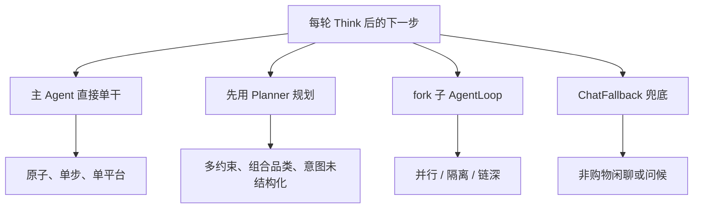

# 19-2 工具与子 Agent 提示词与决策路由

来源：https://alidocs.dingtalk.com/i/nodes/ndMj49yWjXrj207OURw0Orq6J3pmz5aA

作者：会敲代码的泡  
创建时间：07-24 18:04

## AI 概览

本章聚焦 Prompt 工程中工具调用与决策路由的设计，旨在通过结构化工具描述和明确的提示词规则，解决多 Agent 系统中“何时单干、何时规划、何时 fork 子任务”的核心问题，确保模型高效、准确执行，避免冗余或遗漏。

## 本章课程目标

- 掌握工具描述（tool description）的设计范式：做什么 / 何时用 / 何时不用 / 参数内嵌约束 / 并行批量引导。这套范式直接决定模型选不选对工具。
- 把 Globex 9 个工具 + `dispatch_tool` 的描述写法要点整理成一张表，知道每个工具的描述该强调什么。
- 吃透本章核心：决策路由的提示词设计，包括什么时候主 Agent 直接单干、什么时候先用 Planner 规划、什么时候 fork 子 AgentLoop、什么时候走 ChatFallback 兜底。
- 学会把决策路由写进 `<tool_policy>` 段，尤其是 `When NOT to fork` 这类反例约束。
- 掌握 `dispatch_tool` 的 demands 提示词模板，借鉴 Claude Code Task 工具的 stateless / 自包含 / 明确返回摘要三原则。
- 理解同质 fork 下子 AgentLoop 复用哪些 prompt 层、覆盖哪些 prompt 层。

学习建议：这一章是整个 Prompt 工程篇的重心。前一章搭好了 system prompt 的骨架，本章填最关键的 `<tool_policy>` 段。Globex 是多 Agent 项目，“该不该 fork、什么时候 fork”这个决策如果 prompt 写不清，模型要么该并行时不并行（慢），要么鸡毛蒜皮也 fork（乱、贵）。读完你应该能把决策路由画成一棵树，并翻译成模型能照着执行的提示词。

## 1、工具描述的设计范式

### 1.1 一个好的工具描述包含什么

模型选不选对工具，几乎完全取决于工具描述写得好不好。Claude Code 的工具描述有一套稳定的范式，拆开看包含五个要素：

| 要素 | 作用 | Claude Code 例子（Glob 工具） |
| --- | --- | --- |
| 做什么 | 一句话说清能力 | `Fast file pattern matching tool` |
| 何时用 | 正向触发场景 | `Use when you need to find files by name patterns` |
| 何时不用 | 反向排除场景（最容易被忽略） | `When doing open ended search... use the Agent tool instead` |
| 参数约束 | 参数描述里内嵌 `IMPORTANT` | `IMPORTANT: Omit this field... DO NOT enter 'undefined'` |
| 并行引导 | 鼓励一次多调 | `It is always better to speculatively perform multiple searches as a batch` |

其中“何时不用”是最高价值、也最常被漏掉的一条。大多数人写工具描述只写“这个工具能干嘛”，不写“什么时候别用它”，结果模型在边界场景乱选工具。

### 1.2 参数描述里也要写约束

Claude Code 连参数描述都不放过。比如 Glob 的 `path` 参数：

```text
"IMPORTANT: Omit this field to use the default directory.
 DO NOT enter 'undefined' or 'null' - simply omit it for the default behavior."
```

这条约束是从真实 bad case 里长出来的，模型真的会往参数里填字符串 `"undefined"`。参数描述不是类型注释，是防坑说明。

## 2、Globex 工具描述写法要点表

把上面的范式套到 Globex 的 9 个工具 + `dispatch_tool`，每个工具的描述该强调什么，可以整理成一张表：

| 工具 | 做什么 | 何时用 | 何时不用（关键） |
| --- | --- | --- | --- |
| `Planner` | 拆解购物意图为结构化字段 | 意图复杂 / 多约束 / 首轮 | 简单单品查询别用，直接搜 |
| `ChatFallback` | 闲聊兜底 | 非购物类闲聊 | 只要沾购物就别用 |
| `WebSearch` | 检索评测 / 博主推荐 / 价格趋势 | 站内数据不够，需要外部佐证 | 商品检索本身别用它，用 `ItemSearch` |
| `CategoryInsight` | 查品类爆款 / 典型属性（RAG） | 品类不确定、组件不清 | 品类已明确时别多此一举 |
| `ItemSearch` | 单平台商品检索 | 已知平台和明确品类 | 跨多平台时别串行调，用 `dispatch_tool` fork |
| `ItemPicker` | 合流候选集里按偏好精挑 | 已有候选、需二次过滤 | 还没搜到候选时别用 |
| `PriceCompare` | 跨平台候选比价 | 已合流多平台候选 | 单平台结果别比 |
| `ShippingCalc` | 关税 + 运费估算 | 跨境 / 需要真实到手价 | 同境内可跳过 |
| `ShoppingSummary` | 终结性工具，出最终清单 | 信息已足够、准备收尾 | 信息不全时别提前收尾 |
| `dispatch_tool` | 派一个同质子 Agent 执行 demands | 满足 fork 三件事（下一节） | 原子单步任务别 fork（下一节） |

写描述时，“何时不用”这一列比“何时用”更能防止模型乱选。

## 3、决策路由：本章核心

Globex 每一轮 Think 结束时，模型面对的核心问题是：这一步我自己单干，还是先规划，还是派子 Agent？这就是决策路由。

### 3.1 四条分支



下面逐条讲每个分支的判定标准和提示词写法。

### 3.2 分支一：主 Agent 直接单干

判定标准：任务是原子的、单步的、单平台的，主 loop 一次工具调用就能拿到结果。

典型场景：

- 用户已明确“就看亚马逊有没有 XX”，直接 `ItemSearch(platform=amazon)`。
- 多平台候选已经合流回主 loop，直接 `PriceCompare` / `ShippingCalc` / `ItemPicker`。
- 品类已经很明确，不用 `CategoryInsight`，直接搜。

提示词写法（放进 `<tool_policy>`）：

```text
# 何时主 Agent 直接单干
当下一步是"单个原子操作"时，直接调对应工具，不要 Planner、不要 fork：
- 单平台、品类明确的检索 -> 直接 ItemSearch
- 候选已合流回主 loop -> 直接 PriceCompare / ShippingCalc / ItemPicker
- 已到收尾条件 -> 直接 ShoppingSummary

判断口诀：一步能拿到结果、且不需要隔离大输出，就自己干。
```

### 3.3 分支二：先用 Planner 规划

判定标准：意图复杂、带多个约束、且还没被拆成结构化字段。

Planner 的价值不是“多调一次工具”，而是把自然语言意图变成后续所有工具都能直接吃的结构化字段：

```text
用户："旅行三件套，预算 300，不要塑料，喜欢小众，亚马逊和速卖通都看看"

Planner 输出：
budget: 300
category: 旅行三件套
material_pref: {exclude: [塑料]}
style_pref: 小众
platforms: [amazon, aliexpress]
hard_constraints: [预算<=300, 不含塑料]
soft_preferences: [小众风格]
```

提示词写法：

```text
# 何时先用 Planner
当用户意图满足以下任一条，先调 Planner 拆解，再继续：
- 带 2 个及以上约束（预算 + 材质 + 风格 / 平台...）
- 品类模糊或是组合品类（如"三件套""送礼方案"）
- 首轮且信息量大

只有单一、明确的查询（"看看 XX 多少钱"）才跳过 Planner。
```

注意 Planner 和“单干”的边界：简单查询别用 Planner（浪费一轮 + 一次 LLM 调用），复杂意图别跳过 Planner（后续工具拿不到干净字段）。

### 3.4 分支三：fork 子 AgentLoop

判定标准：下一步子任务满足 fork 三件事之一（并行 / 隔离 / 链深）。这三件事的完整论证在第 3 章和 03-0、03-1，这里只讲怎么写进 prompt。

| 三件事 | 含义 | Globex 典型场景 |
| --- | --- | --- |
| 并行 | 多个独立子任务能同时跑 | 跨 4 个平台同时 `ItemSearch` |
| 隔离 | 子任务输出很大，会撑爆主 loop 上下文 | 一次拉 100 件商品做精挑 |
| 链深 | 子任务自己内部还要多轮 Think -> Act | 某平台要“搜 -> 筛 -> 算运费 -> 再筛” |

提示词写法（含反例，这是重点）：

```text
# 何时 fork 子 AgentLoop（dispatch_tool）
当下一步子任务满足以下任一条，调 dispatch_tool(demands="..."):
1. 能并行：多个独立检索可同时跑（如跨 4 平台 ItemSearch）
2. 要隔离：子任务输出很大，会占满主 loop 上下文（如拉 100 件精挑）
3. 链够深：子任务内部还要 >= 3 轮 Think->Act

# When NOT to fork（同等重要）
- 单步就能完成的原子操作 -> 直接单干，别 fork
- 只是想"换个工具调一下" -> 直接调那个工具，别 fork
- 子任务输出很小、不需要隔离 -> 直接单干

fork 有开销（起子 loop + 上下文传递），鸡毛蒜皮别 fork。
```

### 3.5 分支四：ChatFallback 兜底

判定标准：用户输入根本不是购物意图（打招呼、闲聊、问 Globex 是什么）。

```text
# 何时兜底
用户输入与购物无关（闲聊 / 问候 / 询问你的能力）时，
调 ChatFallback，简短友好回应，并引导回购物场景。

不要为闲聊启动 Planner / 检索 / fork。
```

### 3.6 few-shot：四条真实 query 走四条分支

把上面的路由用示例锁定，效果远好于抽象规则。放进 `<examples>`：

```text
<example>  # 走"单干"
user: 亚马逊上那款 XX 键盘现在多少钱
assistant: [Think: 单平台、品类明确 -> 直接 ItemSearch(amazon)]
</example>

<example>  # 走"Planner"
user: 想买套便宜又抗造的旅行三件套，预算300，不要塑料
assistant: [Think: 多约束 + 组合品类 -> 先 Planner 拆解]
</example>

<example>  # 走"fork"
user: 这个背包亚马逊、Shopee、速卖通、eBay 哪个划算
assistant: [Think: 四平台可并行 -> dispatch_tool fork 4 路 ItemSearch]
</example>

<example>  # 走"兜底"
user: 你好，你是谁
assistant: [Think: 非购物 -> ChatFallback]
</example>
```

## 4、dispatch_tool 的 demands 提示词设计

### 4.1 借鉴 Task 工具的三原则

Claude Code 的 Task（子 Agent）工具描述里有三条关于“怎么给子 Agent 派活”的经验，直接适用于 Globex 的 `dispatch_tool`：

| 原则 | Claude Code 原文要点 | Globex demands 落地 |
| --- | --- | --- |
| stateless | `Each agent invocation is stateless` | demands 必须自包含，不能依赖主 loop 的隐含上下文 |
| 任务自包含 | `your prompt should contain a highly detailed task description` | demands 要写清平台、品类、约束、期望产出 |
| 明确返回 | `specify exactly what information the agent should return` | demands 结尾指定“返回什么格式的摘要” |

### 4.2 demands 模板

```text
# dispatch_tool(demands=...) 的 demands 写法模板
在 <platform> 平台检索 <category>，满足以下约束：
  - 硬约束：<hard_constraints，如 预算<=300 / 不含塑料>
  - 软偏好：<soft_preferences，如 小众风格>

检索后按 <排序依据> 取 Top <N>，为每件补齐 <字段，如 价格/评分/是否可直邮>。

返回：一个不超过 <N> 条的候选列表摘要，每条含 名称/价格/平台/关键卖点，
     不要返回原始 API 全量响应（大内容留在子 loop 内）。
```

### 4.3 为什么 demands 要限定“返回摘要”

这一条呼应第 5 章的上下文治理和第 10 章的 monitor：子 AgentLoop 内部可能拉了 100 件商品、上万 token，但回传给主 loop 的只能是精简摘要。demands 里明确“返回什么、不返回什么”，是防止子 loop 把大 payload 灌回主 loop 撑爆上下文的关键。

```text
子 loop 内部：拉 100 件 -> 精挑 -> 5 件（上万 token 留在子 loop）
回传主 loop：5 件的摘要（几百 token）
```

## 5、同质 fork 的提示词复用

### 5.1 子 loop 复用哪些层、覆盖哪些

Globex 用的是同质子 AgentLoop fork，子 loop 和主 loop 用同一个 LLM、同一套范式（第 10 章 `get_llm()` 单例、第 3 章同质定义）。落到 prompt 上：

| system prompt 层 | 子 loop 是否复用 | 说明 |
| --- | --- | --- |
| role / loop / constraints | 复用 | 子 loop 也是 Globex，也走 Think -> Act -> Observe -> Reflect |
| tool_policy | 部分复用 | 子 loop 通常不再 fork（避免无限递归），可在 demands 里约束 |
| examples | 复用 | 同一套行为示例 |
| user_preferences | 复用 | 子 loop 也要遵守用户偏好（如不要塑料） |
| 具体任务 | 覆盖 | 主 loop 的“当前 query”换成子 loop 的 demands |

### 5.2 防止子 loop 再 fork 的约束

一个实战坑：子 loop 复用了主 loop 的 `<tool_policy>`，看到“能并行就 fork”，于是子 loop 又去 fork 孙子 loop，可能失控。提示词层面的防护：

```text
# 在 dispatch_tool 传给子 loop 的上下文里追加
你是被主 Agent 派发的子 AgentLoop，专注完成本次 demands。
除非 demands 明确要求，否则不要再调用 dispatch_tool 二次 fork。
```

这和第 10 章讲的“子 loop 用 sub-xxx thread_id 隔离”是配套的，一个管上下文隔离，一个管行为边界。

## 6、反模式清单

| 反模式 | 后果 | 正确做法 |
| --- | --- | --- |
| 工具描述只写“能干嘛”，不写“何时不用” | 模型边界场景乱选工具 | 每个工具补“何时不用”列 |
| 参数描述当类型注释写 | 模型往参数填 `"undefined"` 之类 | 参数描述内嵌防坑约束 |
| 该 fork 不 fork（跨平台串行 `ItemSearch`） | 慢，四平台排队跑 | `tool_policy` 明确“跨平台 -> fork 并行” |
| 不该 fork 乱 fork（原子操作也 fork） | 贵、乱、上下文传递开销 | 写清 `When NOT to fork` |
| 简单查询也上 Planner | 浪费一轮 + 一次 LLM 调用 | Planner 只给多约束/组合品类 |
| demands 依赖主 loop 隐含上下文 | 子 loop 拿不到关键约束，跑偏 | demands 自包含 + 指定返回格式 |
| 子 loop 无限二次 fork | 递归失控 | 传给子 loop 的上下文里禁止二次 fork |

## 本章小结

到这里，你应该能把 Globex 的“决策路由”从脑子里的直觉，变成模型照着执行的提示词：

1. 工具描述五要素：做什么 / 何时用 / 何时不用 / 参数约束 / 并行引导，其中“何时不用”最防坑，参数描述是防坑说明不是类型注释。
2. Globex 9 工具 + `dispatch_tool` 各有描述强调重点，“何时不用”列比“何时用”更能防乱选。
3. 决策路由四分支：单干（原子单步单平台）/ Planner（复杂多约束未结构化）/ fork（并行/隔离/链深三件事）/ 兜底（非购物闲聊）。
4. 每条分支都要写进 `<tool_policy>`，尤其是 `When NOT to fork` 这类反例约束，并用 few-shot 把四条分支各锁一个真实 query。
5. `dispatch_tool` 的 demands 遵守 stateless / 自包含 / 明确返回三原则，模板里必须限定“返回精简摘要、不回传大 payload”。
6. 同质 fork 下子 loop 复用 role/loop/constraints/preferences，覆盖具体任务，并要显式禁止子 loop 无限二次 fork。

下一章「[19-3 缓存友好写法与元提示词]」会从“作者视角”讲怎么把这些 prompt 写得缓存友好（引用第 5 章机制），并补上会话摘要、Planner 结构化输出、Rubric 评分这些“元提示词”的设计。
