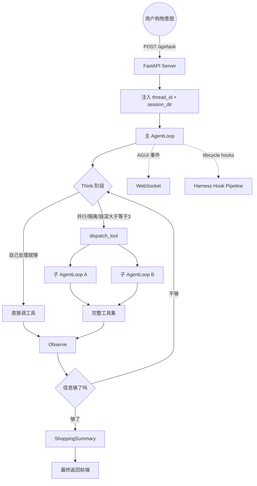

# HeartShop 架构说明

当前钉钉文档把 Globex 描述为一个跨平台对话式购物 Agent。HeartShop 按同一工程地图还原：主 AgentLoop 负责统筹，必要时通过 `dispatch_tool(demands)` fork 同质子 AgentLoop，并通过 9 个工具和 5 类基础设施完成购物任务。

## 请求链路



## AGUI 事件通道

`POST /api/task` 负责启动后台任务并立即返回 `thread_id`。前端随后连接 `WS /ws/{thread_id}` 订阅事件，后端通过统一结构推送：

```json
{
  "type": "monitor_event",
  "event": "tool_start",
  "message": "正在调用 item_search",
  "data": {"tool_name": "item_search", "args": {"query": "旅行收纳袋"}},
  "timestamp": "2026-06-09T14:23:45.123"
}
```

当前标准事件为 `session_created`、`assistant_call`、`tool_start`、`tool_end`、`task_result`、`task_cancelled`、`error`。`thread_id` 同时串起 WebSocket 连接、后台任务表、会话目录、Agent checkpoint 和偏好写入来源。

## Harness Hook Pipeline

Harness 负责过程级治理，覆盖 6 个生命周期 Hook 点：

| Hook | 触发时机 | 当前迁入逻辑 |
| --- | --- | --- |
| `on_session_start` | Agent 任务启动时 | Token 预算初始化、Sequencing/Drift/Phase 状态重置 |
| `pre_think` | 每轮 Think 前 | Token 预算 hint 注入 |
| `pre_tool_call` | 工具执行前 | 工具白名单、阶段权限检查、工具顺序检查、参数 schema 校验 |
| `post_tool_call` | 工具执行后 | 内容过滤、工具结果截断、熔断计数、Schema/Semantic assertion、调用记录 |
| `post_reflect` | 每轮 Reflect 后 | LoopDetector、assertion 汇总、Silent Drift 检测、预算检查、阶段转移与特殊回退 |
| `on_session_end` | Agent 结束时 | 最终输出审核、偏好写回 |

`HarnessMiddleware` 按 priority 从小到大执行 Hook；普通异常会记录并跳过，`HookRejectSignal` 会把当前上下文标记为 `_rejected`，供 `HarnessToolNode` 拦截工具调用。LangFuse 等只观测逻辑继续走 callback，需要修改、拒绝或注入上下文的逻辑走 Hook。

17-3 章补上的实时质量保障分两层：单步验证在工具调用前后检查 Schema / Sequencing / Semantic，失败后由 `assertion_handler` 汇总成系统纠正消息；Silent Drift 每 3 轮检测目标遗忘、探索发散、偏好丢失和成本失控，轻微漂移注入提醒，严重漂移注入强纠正，连续严重漂移要求立即收尾。

17-4 章补上的阶段状态机把模型可见工具集缩小到当前对话阶段：`PLANNING` 负责需求拆解，`SEARCHING` 负责检索和必要的 `dispatch_tool` fork，`COMPARING` 负责比价、运费和精挑，`CONCLUDING` 只负责最终摘要和兜底。`get_filtered_tool_set()` 用当前阶段过滤 `FULL_TOOL_SET`；`phase_check` 防止幻觉调用被隐藏工具；`phase_transition` 根据 planner 输出、候选数量和 picks 数推进阶段；`phase_rollback` 在 COMPARING 连续无进展时回到 SEARCHING。`tool_risk` 额外标记写入类和资源消耗类工具，避免 `shopping_summary` 过早写结果，限制 `dispatch_tool` 的 fork 深度和并发。

## fork 判断

主 AgentLoop 在 Think 阶段遇到任一条件就 fork：

- 能并行：例如 4 个平台的 `ItemSearch` 互不依赖
- 需要上下文隔离：例如子任务会拉回大量候选商品
- 调用链深：子任务内部还需要多轮 Think -> Act -> Observe

不满足这些条件时，主 loop 自己调用工具即可。

## 工具集

| 工具 | 作用 |
| --- | --- |
| `Planner` | 拆解预算、品类、偏好、硬约束 |
| `ChatFallback` | 闲聊或购物链路无法继续时兜底 |
| `WebSearch` | 检索评测、趋势、外部资料 |
| `CategoryInsight` | 从品类 RAG 知识库取爆款、属性、价格档 |
| `ItemSearch` | 单平台商品检索 |
| `ItemPicker` | 合流后按偏好精挑候选 |
| `PriceCompare` | 跨平台归一币种并排序 |
| `ShippingCalc` | 估算关税、运费、到手价 |
| `ShoppingSummary` | 输出最终清单和选购理由 |
| `dispatch_tool` | fork 同质子 AgentLoop |

阶段可见工具矩阵：

| 阶段 | 可见工具 |
| --- | --- |
| `PLANNING` | `planner`、`chat_fallback`、`category_insight`、`web_search` |
| `SEARCHING` | `item_search`、`dispatch_tool`、`web_search`、`category_insight`、`chat_fallback` |
| `COMPARING` | `price_compare`、`shipping_calc`、`item_picker`、`chat_fallback` |
| `CONCLUDING` | `shopping_summary`、`chat_fallback` |

## 代码分层

```text
app/
  agent/          AgentLoop 入口、模型工厂、提示词、dispatch_tool
  api/            FastAPI、WebSocket 连接管理、ContextVar、monitor
  tools/          模型可调用的购物工具
  recall/         三塔客户端、ANN、品类知识库
  memory/         长期偏好 Store 与 prompt 注入
  compress/       Cache Breakpoint 上下文压缩
  eval/           Rubric 评分与轨迹记录
  harness/        Hook Pipeline、默认 Hook、HarnessToolNode
  observability/  Langfuse trace/span 和运行时告警
  prompt/         YAML 提示词
  utils/          路径与 thread scope 工具
```

当前实现还原的是“项目初始化骨架”：API、ContextVar、WebSocket、工具注册、长期记忆、上下文压缩和文档都已经落地。ANN 召回、OpenSearch 品类知识库和模型调用的接口已经存在，但需要配置 `.env`、索引和外部服务后才能进入完整生产链路。
