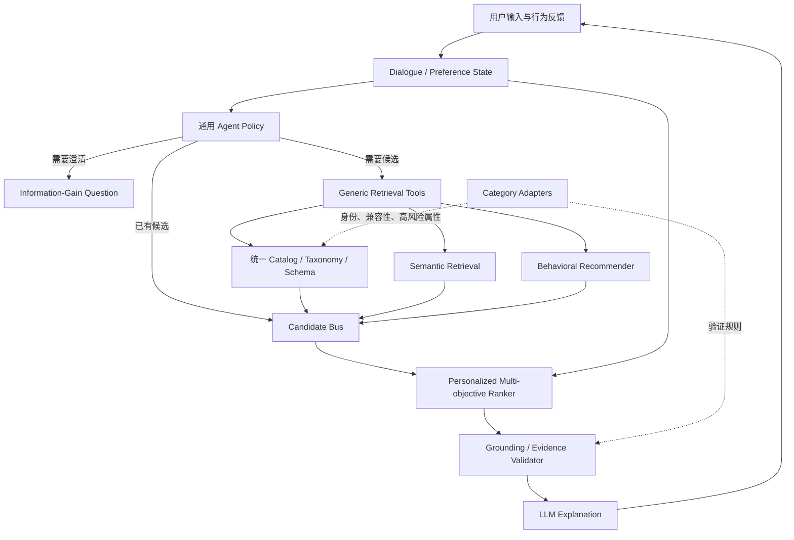

# 对话式推荐 Agent：本质问题、业界架构与 InteRecAgent 演进建议

> 调研日期：2026-08-27
> 范围：Conversational Recommender Systems（CRS）、LLM 推荐 Agent、对话式购物助手
> 目的：回答“为什么当前系统需要一个品类一个品类地实现，以及业界如何构建通用对话式推荐 Agent”。

## 0. 第一版实现状态（2026-08-27）

本轮已在现有 TypeScript Conversation Runtime 与 PostgreSQL 内完成第一版，不引入向量数据库、训练服务或新微服务：

- Goal 接受开放品类与原始 `targetText`；预算变为可选，目标和检索市场仍是研究前置条件。
- `CategoryRecommendationCapability` 成为唯一能力边界：耳机、手机走 `VERIFIED` 适配器，其他品类自动降为 `DISCOVERY`。
- `DISCOVERY` 候选只保持 `OFFER_ONLY` 身份；缺少 GTIN、MPN 等证据时不跨商家合并为 Item，也不冒充已验证推荐。
- 新增确定性 Unicode 分词、PostgreSQL `text[] + GIN` 候选投影、七天 TTL，以及证据未过期前的本地优先 / Provider 兜底检索。
- 排序采用可审计的字典序 `RankVector`：资格层级、目标覆盖、偏好覆盖、冲突、证据、库存、价格、新鲜度、稳定 ID；第一版不使用无训练数据支撑的学习排序器。
- 新增追加式反馈账本，原子记录曝光、聚焦、对比、拒绝、恢复和 critique；会话偏好可在零 Provider 调用下重排现有 WorkingSet，且不修改 proof pool。
- Assistant 与前端明确展示 `DISCOVERY` / `VERIFIED` 和 `OFFER_ONLY` / `VERIFIED_ITEM`，旧投影不会被默认标成已验证。

验收结果：完整 acceptance 通过（24 个测试文件、156 项测试，另有 2 个 PostgreSQL 文件默认门禁跳过），显式连接本机 PostgreSQL 后 23 项集成测试通过；未注册第三品类“洗衣机”已覆盖无预算研究、证据生成与 Discovery 身份边界。

仍需额外资源的后续能力没有伪装进第一版：统一商品目录/GTIN 数据、语义向量召回、评论与内容语料、跨会话长期画像、学习排序训练样本、真实点击/购买回传及线上 A/B 实验平台。

### 0.1 真实外部链路验收

本轮还使用现有 DeepSeek、BuyWhere、FX 与 PostgreSQL 配置执行了受控线上验收；脚本只输出非敏感摘要，所有外部调用均有显式确认开关：

| 场景 | 首轮结果 | PostgreSQL 证据 | 后续零检索行为 |
| --- | --- | --- | --- |
| 耳机 `headphones` | `RECOMMENDATION`，4 个 `VERIFIED` 候选 | 4 次商品调用、2 次 FX、4 份工件、28 条 Claim | 缩窄美国市场、增加轻便偏好、拒绝当前候选均为 0 次 Provider 调用；拒绝写入反馈账本 |
| 手机 `smartphone` | `RECOMMENDATION`，2 个 `VERIFIED` 候选 | 4 次商品调用、3 次 FX、4 份工件、14 条 Claim | 缩窄美国市场并比较当前候选为 0 次 Provider 调用，复用已有 proof |
| 洗衣机 `washing_machine` | `DISCOVERY`，1 个 `OFFER_ONLY` 候选 | 2 次商品调用、2 次 FX、2 份工件、7 条 Claim | 增加节能和低噪音偏好后本地重排，0 次 Provider 调用 |

真实模型验收还暴露并修复了三个离线假模型不容易发现的问题：

1. OpenAI-compatible 模型会把“无预算”编码成空字符串预算操作。现采用“宽 wire proposal、原文归一化、严 domain validation”三段式边界，空占位不会进入 Goal。
2. Discovery 候选的商品角色可能是 `UNKNOWN`。二次投影改用三值逻辑：未知不是冲突，只有已知且不匹配才淘汰。
3. 通用偏好键曾能进入 schema，却只能执行价格排序。Host 现可用当前 Goal 的任意已存在偏好做确定性重投影，未知偏好键仍失败关闭。

一次研究操作会按“检索波次 × 市场”展开为多次物理 Provider 调用。因此产品层的“每轮最多一次研究授权”不等于成本层的一次 HTTP 请求；生产预算和限流必须按物理调用计量。

### 0.2 第一版资源边界与投入顺序

第一版可以继续只用现有项目与 PostgreSQL，不需要新建微服务、Kafka、图数据库、独立向量数据库、训练平台或“每品类一个 Agent”。PostgreSQL 当前即可承担：会话事件、Goal 修订、WorkingSet、候选投影、反馈账本、Provider 工件索引、Claim/Proof、租约、幂等和审计查询。

需要区分两类“额外资源”：

| 资源 | 第一版是否必需 | 原因与建议 |
| --- | --- | --- |
| LLM 推理额度 | 必需的运行资源 | 用于自然语言到 TurnPlan 及回复结构化；必须配置 token/调用预算、超时和确定性降级 |
| 商品搜索 Provider 配额 | 必需的运行资源 | PostgreSQL 不能自行产生实时商品、价格和库存；按物理调用做租户限流、缓存和成本监控 |
| FX 数据源 | 跨币种比较时必需 | 失败时应保留原币证据或降级，不能编造汇率 |
| PostgreSQL 备份、监控与高可用 | 上生产时必需 | 单机开发库足够做第一版，生产需容量、备份恢复、连接池和告警 |
| 统一商品目录与 GTIN/MPN/品牌型号映射 | 提升到跨商家 Item 推荐时必需 | 这是从 `OFFER_ONLY Discovery` 升级为可信 Item 合并和全品类 Verified 的最高优先级外部数据资源 |
| 商品描述、规格、评论和问答语料 | 提高偏好匹配与解释质量时必需 | 当前 Provider 标题不足以可靠判断节能、噪音、舒适度等属性 |
| Embedding 模型 | 做语义召回时必需 | 初期可安装 `pgvector` 继续复用 PostgreSQL，无须先引入独立向量数据库 |
| 点击、停留、接受、拒绝、购买回传 | 做个性化和学习排序时必需 | 当前拒绝/比较等会话反馈只能支持规则排序，不能替代真实效果标签 |
| 用户身份、授权与长期画像治理 | 跨会话个性化时必需 | 需要同意、删除、保留期、敏感属性隔离和租户边界，不应仅凭会话内容默认建立永久画像 |
| 离线评测集、人工标注和线上 A/B 平台 | 优化策略时必需 | 没有反事实/线上评估，无法证明新 Ranker 或提问策略优于当前确定性基线 |
| 学习排序训练算力与模型服务 | 有足够反馈数据后才需要 | 不应在没有样本前先建；先保留可审计 RankVector 作为基线 |
| 品类专家与权威 API | 高风险或复杂兼容品类需要 | 医疗、母婴安全、汽车配件兼容、保修/税费/配送等不能仅靠通用 LLM 与标题推断 |

推荐投入顺序：

1. 先上线双通道：所有品类可 `DISCOVERY`，少数已有 Adapter 的品类可 `VERIFIED`；保持明确能力标签。
2. 先买或建设统一商品身份与规格数据，而不是继续复制 Agent 流程。这是解除“一个品类一个品类做”的最高杠杆。
3. 在现有 PostgreSQL 增加 `pgvector` 和 ItemDocument，形成 BM25/词法 + 向量 + 实时 Offer 的混合召回。
4. 收集真实曝光、点击、接受、拒绝和购买信号，先做离线评测，再考虑学习排序。
5. 最后才拆独立检索/特征/模型服务；只有容量、团队边界或延迟数据证明 PostgreSQL 单体成为瓶颈时再拆。

因此，第一版的优雅边界不是“全品类都强验证”，而是：

```text
通用对话与推荐状态
  + 全品类有边界的 Discovery
  + 少数高价值品类 Verified Adapter
  + PostgreSQL proof / feedback / audit
  + 外部实时商品与 LLM 运行额度
```

它能够立即验证用户价值，也不会把尚未拥有的目录、行为数据和推荐模型伪装成代码能力。

## 1. 结论摘要

“一个品类一个品类做”不是对话式推荐 Agent 的必然形态，而是当前系统的抽象边界造成的。

当前项目的主链更接近：

```text
LLM 对话规划
  + 品类专用 CategoryContract
  + 商品 Provider 检索
  + 确定性资格审查
  + 证据优先 Offer 排序
```

其中 `CategoryContract` 同时承担了品类识别、型号抽取、主商品/配件区分、查询编译、属性证明和资格审查等职责。每增加一个品类，都必须新增一组代码规则和测试，因此品类自然成为系统的开发与交付单位。

业界更常见的目标架构是：

```text
LLM 对话与规划
  + 长短期用户偏好状态
  + 通用候选召回
  + 推荐/排序模型
  + Candidate Bus
  + 商品目录与属性 Schema
  + 事实检索和证据校验
```

在这种架构中，品类仍然存在，但主要是商品数据、属性 Schema、排序特征和验证插件，而不是 Agent 的能力边界。

因此，本项目下一阶段不应以“继续增加更多硬编码 CategoryContract”为主，而应保留已有的 Conversation、Turn、Goal、WorkingSet 和 Proof 主链，引入通用召回、用户画像和个性化 Ranker，将 CategoryContract 收缩为可配置的商品语义与事实验证层。

## 2. 当前系统为什么会逐品类实现

### 2.1 当前推荐链路

当前自然语言请求经过以下链路：

1. LLM 将本轮输入转换为有序 `TurnPlan`。
2. Host 校验计划、操作来源和调用权限。
3. Goal 保存品类、预算、市场、条件和偏好。
4. `CategoryContract` 编译检索词并定义品类语义。
5. Provider 返回原始商品和 Offer。
6. 确定性内核执行身份解析、约束核验、去重和排序。
7. 事实被转换为带证据的 Claim。
8. 验证后的回答与新状态原子提交。

这种设计在防止商品事实幻觉、保证价格和市场证据可追溯方面很强，但商品理解能力主要依赖品类代码。

当前只正式注册了 `headphones` 和 `smartphone`：

- Agent Prompt 限制规范品类 ID：`packages/agent/src/turn-agent.ts`
- 品类别名、型号、配件和属性规则：`packages/domain/src/catalog-contracts.ts`
- 商品资格审查和排序：`packages/domain/src/kernel.ts`

### 2.2 抽象边界的问题

当前设计把两个不同问题混合在了一起：

1. **偏好不确定性**：用户究竟喜欢什么、哪些条件是必须的、下一步应该问什么。
2. **商品事实不确定性**：商品身份、价格、库存、市场、成色和属性是否有可靠证据。

当前系统对商品事实不确定性处理得很深入，但对偏好建模和个性化排序处理较浅。因此所谓“推荐”主要表现为：

```text
硬条件符合
  → 商品身份可验证
  → 市场证据可信
  → 库存更明确
  → 价格更低
```

当前默认排序是：

```text
市场证据可信度
  → 明确有货
  → 同层价格
  → 数据新鲜度
  → 稳定 Offer ID
```

这能够回答“哪个 Offer 更可靠”，但还不能充分回答“哪个商品最适合这个用户”。为了保证可靠性，系统必须预先编码每个品类的身份和属性证明规则，最终表现为逐品类建设。

## 3. 对话式推荐 Agent 的本质

经典 Conversational Recommender Systems 关注的核心问题不是完整识别所有商品属性，而是：

> 在多轮交互中持续估计用户偏好，主动降低偏好不确定性，并在合适时机给出推荐。

主要能力包括：

- 从自然语言和行为历史中获得用户偏好。
- 区分硬约束、软偏好、长期兴趣和本轮临时需求。
- 决定何时继续提问、何时开始推荐。
- 根据喜欢、不喜欢、比较和 critique 动态更新候选。
- 在探索新偏好与利用已知偏好之间权衡。
- 生成与真实推荐结果一致的自然语言解释。

因此，真正的 CRS 状态不只是 Shopping Goal，还包括：

- `like`：长期喜欢的商品、属性或风格。
- `dislike`：长期排斥项。
- `expect`：当前会话即时需求。
- `hardConstraints`：必须满足的条件。
- `softPreferences`：参与排序但不一票否决的条件。
- `critiques`：相对当前候选希望怎样调整。
- `uncertainty`：当前最值得澄清的偏好维度。

## 4. 业界与研究中的通用架构

### 4.1 对话理解与履约解耦

Google ShopTalk 将对话理解与 Shopping Fulfillment 解耦。领域无关的语言理解模块将用户表达转换成少量通用 intent operators，由 Dialogue-State Tracker 更新状态并生成检索请求。

其关键不是为每个品类编写一套对话，而是让对话层只理解通用动作：

- 添加或移除条件。
- 表达喜欢或不喜欢。
- 修改当前需求。
- 请求比较、解释或推荐。
- 接受或拒绝候选。

商品域的差异由下游目录、Schema 和检索系统处理。

### 4.2 LLM 作为大脑，推荐系统作为工具

原始 InteRecAgent 论文提出的核心架构是：

> LLM 是大脑，已有的领域推荐模型是工具。

其最小工具集合包括：

1. **Information Query**：查询商品信息。
2. **Item Retrieval**：根据硬条件和软条件召回候选。
3. **Item Ranking**：结合用户画像对候选进行个性化排序。

论文还引入：

- **Candidate Bus**：在工具之间传递候选，避免把大量商品放进 LLM Prompt。
- **Long-term / Short-term User Profile**：维护长期兴趣和当前会话需求。
- **Plan-first Execution**：先生成完整工具计划，再顺序执行。
- **Reflection**：由 Critic 检查计划、工具输出和最终回答。

当前项目已经具备 Plan-first 和 Candidate Bus 的部分形态，但尚缺少真正的推荐模型、长短期用户画像与个性化 Ranker。

### 4.3 多路候选召回

通用推荐平台通常不会只依赖品类正则和搜索关键词，而是组合多种召回方式：

- 结构化过滤：品类、价格、品牌、尺寸、市场等。
- 关键词检索：BM25 等词法检索。
- 语义检索：Conversation/Query Embedding 与 Item Embedding。
- Item-to-Item：召回与用户喜欢商品相似的候选。
- Collaborative Filtering：利用相似用户和历史交互。
- Sequential Recommendation：根据行为序列预测下一物品。
- 热门、新品和探索候选。

Google 的 Conversational Recommendation as Retrieval 研究把整段对话表示成 Query、商品表示成 Document。简单 BM25 就能与复杂知识图谱方法竞争，说明通用 CRS 不必先为每个品类建设完整专用知识图谱。

### 4.4 多目标个性化排序

通用 Ranker 通常综合：

```text
当前意图相关性
+ 长期兴趣匹配
+ 本轮反馈匹配
+ 语义相似度
+ 行为模型预测
+ 多样性与探索
+ 商品事实可信度
+ 安全、库存和商业约束
```

其中事实可信度应该是过滤条件或排序特征之一，而不应成为推荐能力的主体。

Google REGEN 将历史行为、自然语言 critique、推荐和个性化解释放在统一任务中。其研究表明，加入自然语言 critique 能改善 Recall@10，说明用户对当前候选的自然语言反馈应直接进入推荐模型，而不只是转成静态筛选条件。

### 4.5 多源事实 grounding

大型购物助手会从统一商品目录、评论、社区问答、商店 API 和 Web 证据中检索信息，再由 LLM 生成回答。

Amazon Rufus 的公开技术说明包括：

- 面向购物数据训练的专用 LLM。
- 整个 Amazon 商品目录。
- 评论和社区问答。
- Stores API。
- 多源 RAG。
- 强化学习和流式响应。

其扩展单位是统一购物数据和检索能力，而不是每个品类一套对话 Agent。

Amazon PEARL 则将多轮对话中的偏好抽取为电商可执行的 key-value filters，并动态检索相似示例辅助抽取。这也是“通用偏好抽取 → 商品检索”的模式。

## 5. 品类知识应该放在哪里

通用架构不意味着完全消灭品类知识。品类差异应主要位于数据和插件层。

### 通用 Agent 层

- Conversation、Turn 和版本管理。
- 多轮状态与指代解析。
- 长短期用户画像。
- 硬约束、软偏好和 critique 更新。
- Ask / Retrieve / Recommend 策略。
- Candidate Bus。
- 工具计划和执行协议。
- 推荐解释、证据引用和失败降级。

### 推荐平台层

- 商品和用户 Embedding。
- 结构化检索、语义召回和协同过滤。
- 个性化 Ranker。
- 多样性和探索策略。
- 行为特征和反馈学习。

### 品类与商品语义层

- 属性 Schema 和单位。
- 主商品、配件和耗材关系。
- 型号、变体和兼容性规则。
- 品类专用排序特征。
- 高风险事实验证。

### 商品事实层

- 价格、库存、商家和市场。
- FX、税费和配送信息。
- Evidence、Claim 和数据新鲜度。

换言之，应将品类逻辑从：

```text
if category == smartphone ...
if category == headphones ...
```

迁移为：

```text
Catalog Schema
Attribute Dictionary
Item Embedding
Behavioral Features
Category Adapter
Verification Policy
```

## 6. 当前项目与目标架构的差距

| 能力 | 当前状态 | 目标状态 |
| --- | --- | --- |
| 多轮持久状态 | 已具备 Goal、Dialogue、WorkingSet | 保留并扩展 |
| Agent 执行 | 已具备 Plan-first 和确定性 Host | 保留 |
| Candidate Bus | WorkingSet 已具备雏形 | 升级为通用候选总线 |
| 商品事实安全 | Proof、Claim、Envelope 验证较强 | 保留为独立 Grounding 层 |
| 品类理解 | 两个硬编码 CategoryContract | Schema Registry + 可选 Adapter |
| 候选召回 | Provider 关键词检索为主 | 结构化、语义、ItemCF、行为多路召回 |
| 用户画像 | 主要是当前 Shopping Goal | 长期 like/dislike + 短期 expect/critique |
| 推荐排序 | 证据、库存、价格优先 | 个性化相关性 + 证据/交易约束 |
| 提问策略 | 主要依赖固定缺失槽 | 基于候选区分度和信息增益 |
| 学习闭环 | 基本没有 | 点击、接受、拒绝、购买和 critique 反馈 |
| 适用范围 | 耳机、手机正式支持 | 全品类 Discovery，重点品类增强验证 |

## 7. 建议的目标架构



核心原则：

1. Agent 不感知具体品类流程，只感知通用推荐动作。
2. 品类是 Catalog 中的数据维度，不是 Agent 分支。
3. WorkingSet 演进为 Candidate Bus，工具只交换候选 ID 和摘要。
4. 硬约束由检索过滤，软偏好和 critique 进入 Ranker。
5. 证据质量参与资格审查和排序，但不替代个性化相关性。
6. 全品类可以先支持 Discovery；高价值品类逐步增加强验证 Adapter。

## 8. 推荐演进顺序

### 阶段一：建立通用推荐抽象

- 将 Goal 拆成 `SessionIntent`、`HardConstraints`、`SoftPreferences` 和 `Critiques`。
- 增加长期 `UserProfile` 与短期 `SessionProfile`。
- 将 WorkingSet 明确升级为 Candidate Bus。
- 定义通用工具协议：`query_item`、`retrieve_hard`、`retrieve_semantic`、`rank_candidates`、`inspect_item`。

### 阶段二：补齐多路召回

- 建立统一 ItemDocument 和 Category Path。
- 为商品标题、描述、属性和评论建立 Embedding。
- 增加结构化过滤、BM25 和向量召回。
- 将 Provider 实时 Offer 作为候选事实补充，而不是唯一商品语义来源。

### 阶段三：引入真正的 Ranker

- 第一阶段可采用可解释加权 Ranker。
- 随后接入 Item-to-Item、协同过滤或序列推荐模型。
- 将喜欢、拒绝、比较、点击和购买变成排序反馈。
- 把证据可信度、库存和价格作为特征或约束。

### 阶段四：收缩 CategoryContract

- 将别名和属性定义迁移到版本化 Schema Registry。
- 用离线抽取和 Embedding 替代大部分手写正则。
- Category Adapter 仅保留身份、兼容性和高风险属性验证。
- 建立 `DISCOVERY`、`BASIC`、`VERIFIED` 等能力等级，避免未增强品类完全不可用。

### 阶段五：改进对话策略与评测

- 根据候选集熵、区分度或预期信息增益选择澄清问题。
- 评测 Recall/NDCG、成功率、接受率、平均轮数、偏好一致性、事实 groundedness、延迟与成本。
- 使用真实多轮对话与用户模拟器进行轨迹评测，而不只测试单轮工具协议。

## 9. 最终判断

当前项目的 Conversation Runtime、Plan-first、WorkingSet 和 Proof 链路是有价值的基础设施，不需要推倒重来。

真正限制系统扩展性的不是多轮对话，也不是 Agent 协议，而是：

> 当前没有独立的通用推荐平台，导致 CategoryContract 被迫代替商品理解、召回和推荐模型。

正确的演进目标是：

```text
当前：LLM + 品类规则 + 商品检索

目标：LLM + 用户偏好记忆 + 通用召回 + 推荐模型 + 商品证据
```

品类仍然需要治理，但应该成为数据和验证插件，不应继续成为 Agent 的能力边界。

## 10. 主要参考资料

1. Gao et al., [*Advances and Challenges in Conversational Recommender Systems: A Survey*](https://arxiv.org/abs/2101.09459)
2. Huang et al., [*Recommender AI Agent: Integrating Large Language Models for Interactive Recommendations*](https://arxiv.org/html/2308.16505v3)
3. Google Research, [*ShopTalk: A System for Conversational Faceted Search*](https://research.google/pubs/shoptalk-a-system-for-conversational-faceted-search/)
4. Google Research, [*Conversational Recommendation as Retrieval: A Simple, Strong Baseline*](https://research.google/pubs/conversational-recommendation-as-retrieval-a-simple-strong-baseline/)
5. Google Research, [*REGEN: Empowering personalized recommendations with natural language*](https://research.google/blog/regen-empowering-personalized-recommendations-with-natural-language/)
6. Amazon Science, [*The technology behind Amazon's GenAI-powered shopping assistant, Rufus*](https://www.amazon.science/blog/the-technology-behind-amazons-genai-powered-shopping-assistant-rufus)
7. Amazon Science, [*PEARL: Preference extraction with exemplar augmentation and retrieval with LLM agents*](https://www.amazon.science/publications/pearl-preference-extraction-with-exemplar-augmentation-and-retrieval-with-llm-agents)
