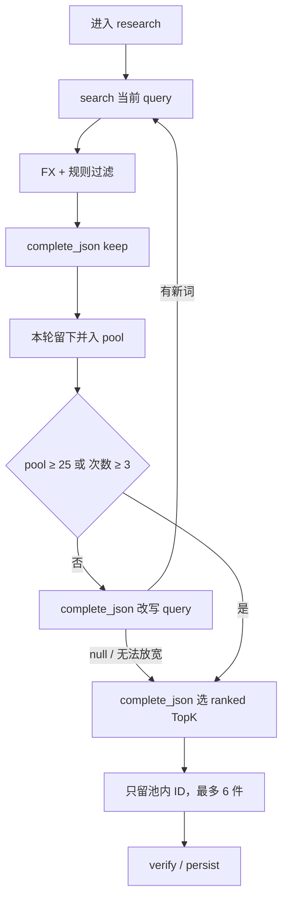

# 研究控环：问题与方案变迁

**版本**：1.0  
**日期**：2026-08-20  
**项目**：InteRecAgent · 跨境选物台  
**文档类型**：问题复盘 + 方案取舍  
**范围**：`research` 子图内部怎么检索、过滤、累加、停搜、出 TopK。外层话轮分叉不在本文；工具为什么多数无参见 [research-tool-use-scheme-evolution.md](./research-tool-use-scheme-evolution.md)。

本文记录 2026-08-20 拍板并落地的环：检索 → 规则过滤 → 模型 keep → 并入池子 → 未达阈值则改写再搜 → 达阈值或次数用尽则模型选 TopK。事实层 / 决策层 / 语言层的职责分离不变：模型不得编造商品、价格、库存、汇率，也不得改硬预算。

---

## 1. 要解决什么

联调里推荐结果又多又脏。根因不是「少了一张粗排/精排漏斗」，而是研究子图的环境在惩罚正确行为：

| 当时的行为 | 用户看见的失败 |
|---|---|
| 再搜覆盖 `ctx.products` | 第一次滤干净的集合被第二次脏召回盖掉 |
| 相关性只靠规则词表 | 配件 / 错品类会打穿；加词会误杀型号名，bad case 无穷 |
| 「太少再搜」写在提示词里 | 模型可以因为 sample 难看而空搜；没有硬阈值 |
| TopK 是 `score_and_rank` 截断 | 不能按购买意图比较；对照卡一度铺到 8 件以上脏结果 |
| 自由 ReAct 点工具 | 顺序、停搜、是否累加都不可复现 |

规则闸（配件词、品类线索、禁止整表灌回）仍然要留：它挡的是**已复现、叫得出名字**的脏模式。开放的「像不像要买的东西」不能靠继续加 `_ACCESSORY_WORDS`。

---

## 2. 变迁总览

```text
阶段 0  静态线性链
        检索 → FX → 过滤 → 排序
        空集直接放弃
            │
            ▼
阶段 1  受限 ReAct（AGT-001）
        模型自由点 search / fx / filter / rank / finalize
        最多 8 步；再搜覆盖当前列表
            │
            ▼
阶段 2  规则收紧
        配件丢掉、禁止整表灌回、对照硬顶 8 件
        法官仍只在规则层
            │
            ▼
阶段 3  后端控环（现行）
        控制器推进，模型只做三次单次 JSON
        再搜并入池子；N=25 / R=3 / K=6
```

| 阶段 | 若退回去会看见 | 根因层级 | 落点 |
|---|---|---|---|
| 0 | 空结果不会换词 | 编排不能重试 | 研究子图内循环 |
| 1 | 第二次检索搅浑第一次 | 环境覆盖集合 | 累加池 + listing 去重 |
| 2 | 新脏例只能继续加词 | 规则当通用相关性模型 | 规则先闸，模型再 keep |
| 3 | 模型自由点工具、停搜漂 | 环不由后端收 | `run_research` + 硬门槛 |

外层图不动：`route_turn` 仍是 talk / refilter / rerank / research 五选一。research 不是每句默认路径。

---

## 3. 拍板记录

讨论过推荐漏斗范式和自主 Agent 范式。两边同意的是：**Agent 开发在这里就是后端开发**——用环境契约收环，不靠把模型训得更听话。

否决过：

| 方案 | 否决原因 |
|---|---|
| 语义相似度当硬删除闸 | 共享名词（Monitor Cable）分偏高，纯型号（COWIN E7）分偏低；还要挂嵌入服务，无 Key 路径分叉 |
| 模型划 ID 当主闸（代替规则） | 漏抽、编 ID、两次不一致；`refilter` / 缓存复用会漂 |
| 自由 ReAct 自己决定何时搜、何时 finalize | 「少」没有环境阈值；会因为 sample 难看而重搜 |
| 再搜覆盖当前列表 | 环境在惩罚累加 |
| 看「本轮剩余件数」决定停搜 | 本轮 6、池子已 12 时还会继续搜 |

锁定（2026-08-20）：

| 编号 | 决策 | 取值 |
|---|---|---|
| D1 | 停搜看什么 | **A**：每轮先并入 `pool`，再看 `len(pool)` |
| D2 | 三个数字 | **N=25**（停搜阈值）、**R=3**（最大检索次数，含第一次）、**K=6**（最终展示） |
| D3 | 模型过滤输出 | **keep**：只输出要留下的 ID；没勾到的本轮丢掉 |

N 大于 K，停搜后模型才有得比。数字只写在 `ResearchLimits`，不写进提示词当软约束。

---

## 4. 流程模型

控制器在后端。模型只在两个过滤点、一个改写点、一个终选点出场。

```text
进入 research
    │
    ▼
search(current_query)          最多 R=3 次
    │
    ▼
FX + 规则过滤                  预算 / 库存 / 排除词 / 已知脏模式 / 规格门闩
    │                          相关性仍用用户原 query，不用改写词
    ▼
模型 keep                      只对规则留下的 ID 勾选
    │                          失败 → 本轮规则结果全部留下
    │                          成功且 keep=[] → 本轮不并入
    ▼
listing key 去重并入 pool
    │
    ▼
pool ≥ 25  或  已搜满 3 次  或  无法改写？
    │
    ├─ 否 → 模型改写 query（失败则确定性放宽）→ 再搜
    │
    └─ 是 → 模型按规则 prompt 从 pool 选有序 TopK=6
              求交失败 → run_rank 截断 6 件
              persist / 对照卡
```



### 4.1 本轮 vs 池子

`ctx.products` / `ctx.batch` 是**这一次检索**经过规则后的对象。`ctx.pool` 是**本趟研究**已并入的对象。`search_products` 不得清空 `pool`。

去重键是 listing key（page / title / src），不是某一次 snapshot id。重搜会换快照 ID，同一商户页不得进两次。

### 4.2 三次 JSON

都走 `ModelBackend.complete_json`：系统提示 + 一条 user JSON。不是 tool-calling 聊天，也不是用户对话历史。

| 步骤 | 输入 | 合法输出 | 失败时 |
|---|---|---|---|
| keep | 本轮规则后的 brief（最多 40，多则先规则粗排） | `{ "keep": ["id", ...] }` | 整批并入 |
| rewrite | 当前词、意图词、已用过的词、池子样本 | `{ "query": "..." }` 或 `{ "query": null }` | 见下 |
| select_topk | 整个 pool 的 brief、K、预算、偏好 | `{ "ranked": ["id", ...] }` | `run_rank` |

求交规则：ID 不在当前集合里的丢掉；重复丢掉；漏抽不补；编造不算。keep 语义下，没出现在 `keep` 里的本轮 ID 丢掉，不能把规则已删的救回来。

改写成功返回 `null`（模型明确说写不出更好的词）→ **停搜**，不再偷偷扩市场。改写调用失败（无 JSON / 上游不可用）或无模型 → 确定性放宽：先放宽原币预算上限再搜同一词，再不行则扩到默认市场 `US+SG`。已经用过的检索词不得再用。

### 4.3 无模型

`is_configured()` 为假时走**同一条** `run_research`，跳过三次 JSON。不要再写一条平行线性函数。对照上限与 K 对齐：`MAX_RANKED_CANDIDATES = 6`。

运行过期（`version_probe` 发现约束版本变了）则立刻停，不补全、不写库。

---

## 5. 环境契约

`ResearchContext` 从「当前一次检索结果」改成「本趟研究的工作总线」。

| 字段 | 含义 |
|---|---|
| `batch` / `products` | 本轮检索 + 规则后的对象 |
| `pool` | 已并入、已过规则（及成功 keep）的对象 |
| `current_query` | 本轮实际检索词，可被改写 |
| `rewritten_queries` | 审计：改过哪些词 |
| `search_count` | 已检索次数 |
| `limits` | N / R / K / 送审上限 |

硬门槛：

```text
ResearchLimits
  pool_threshold = 25
  max_searches   = 3
  top_k          = 6
  max_judge_batch = 40
```

模型看不见全量 snapshot，只看见 id / title / merchant / market / rmb_price / in_stock。写库仍只在 persist。工具不写 `candidate_sets`。

相关性规则过滤继续用 `mission.constraints.query`（用户意图），不用改写后的检索词。改写只影响召回，不放宽品类门闩。

---

## 6. 文件对照

| 职责 | 文件 |
|---|---|
| 控环 | `backend/agent/loop.py` |
| keep / 改写 / TopK 提示与解析 | `backend/agent/judges.py` |
| 并入与 ID 求交 | `backend/agent/pool.py` |
| 门槛与总线 | `backend/agent/tools/context.py` |
| 检索 / FX / 规则过滤执行器 | `backend/agent/tools/catalog.py` |
| 研究节点入口（`is_configured()`） | `backend/agent/nodes/research.py` |
| 规则过滤与对照截断 | `backend/application/services/rec/pipeline.py` |
| 单次 JSON Port | `backend/application/ports/model_backend.py` `complete_json` |
| 环测试 | `tests/test_agent_loop.py`、`tests/eval/test_research_invariants.py` |

验收过的行为：keep 求交丢掉编造 ID；空 keep 不并入；池子达到阈值不再搜；改写后第二波并入；JSON 失败回退规则排序；无模型仍产出可追溯、不超预算的候选。

联调时还修了两个会让页面空白、挡检验的问题，不属于本环但同日落地：

| 问题 | 落点 |
|---|---|
| `CATALOG` 在 `FIXTURE_IMAGES` 初始化前调用 `candidate()` | `frontend/src/api/fixture.ts` |
| Vite 只听 `[::1]:5173`，Chrome 走 IPv4 连不上 | `frontend/vite.config.ts` `host: 127.0.0.1` |

---

## 7. 以后不要退回去的几条

1. **后端控环。** 不要把「要不要再搜、何时结束」交回自由 tool-calling。  
2. **再搜必须并入。** 禁止 `ctx.products = 新结果` 盖掉池子。  
3. **停搜看累计件数。** 先 merge 再比 `len(pool)` 与 N，或次数到 R。  
4. **规则先闸，模型再 keep。** 模型不能救回规则已删的 ID；失败跳过，不能卡住 run。  
5. **TopK 只能点池内 ID。** 漏抽不补；失败回退 `run_rank`。  
6. **数字在 `ResearchLimits`。** 不要把 25 / 3 / 6 只写在提示词里。  
7. **无模型同一条环。** 禁止再写一套只给降级用的线性研究函数。  
8. **词表冻结。** 新脏例默认不加 `_ACCESSORY_WORDS`；开放相关性走 keep，不走无限规则。

下一轮若要加商品详情或价格历史，先问：这是软决策还是硬步骤，以及它读写的是 `batch` 还是 `pool`。外层分叉见 [dialogue-route-scheme-evolution.md](./dialogue-route-scheme-evolution.md)；工具签名见 [research-tool-use-scheme-evolution.md](./research-tool-use-scheme-evolution.md)；规则相关性收口见 [live-hardening-scheme-evolution.md](./live-hardening-scheme-evolution.md)。
